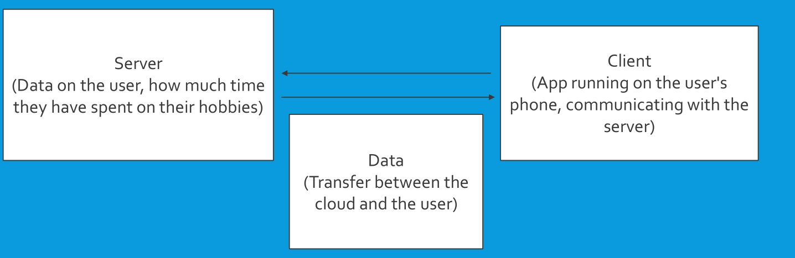

# Design

Our system is a user-modified client, that processes the user's data regarding tracking their hobby, time contributions, and various other things. 

This state is sent to the database server, where it is stored for cloud access and storage. The feedback we received was that our architecture design was the correct one for the job, and that we chose correctly, so we implemented it full steam ahead.

## Arch Explination

Here is a diagram of our architecture from our presentation showing the design of our app with the central data store. This shows how we have a client server relationship with regards to our app. This client server shows how the app syncs data to the server and how the app will pull data back from the server.

## Classes

The major classes in our system are the ones related to auth, where it sends checks to the FireBaseAuth database, and saves the state whether you are logged in or the details entered are correct etc... these classes are linked to a wrapper class that shows the correct page based off of whether you are logged in, on the home page or another page. Also connected to the wrapper class, are other major classes for calendar and for timer, which have their own subclasses that facilitate those objects and their pages function. These all then get piped through to the main class to display the contents properly on your screen.

## Control
Our control is single threading, but waits asynchronously, so it emulates being multithreading as a result.

Some external communication that could affect control is syncing to the database. If it is down, then the data that is synced will not be fresh and there could be a conflict. Some ways to fix this would be to make sure the database is up before trying to save anything and if there is something to sync merging them together when the database comes back up.
