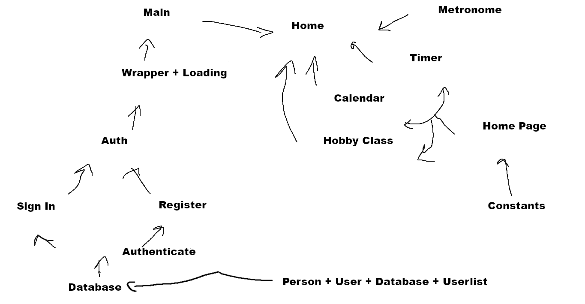

# Requirements Specification for Hobby Hub

**1. Introduction**

**1.1 Purpose of Product**

We wanted to make an app to help people find new hobbies and improve on ones they are already learning. We think that everyone wants to learn something new, so we believe that this app with help with that by showing people their true potential in their skillsets. We got a lot of the base features implimted but not a lot of the hobby info features.

**1.2 Scope of Product**

Our scope is to help more people learn and focus. By tracking how long you are spending practicing people can know how long they have been practicing and feel more accomplished in their task.

**2. General Description of Product**

Our app has a timer to track the amount of time each person is spending on their hobby and use that time to show them the total time they have been practicing. Then they can view all their practice times in one place to track their progress.

**2.1 Context of Product**

The environment our app will be in is a personal environment. For example, at home when the user has some free time and wants to practice their hobbies. 

**2.2 Domain Model with Description**
Display and describe your domain model.

Our diagram shows the flow starting from the database. The database has the models for each of the things we wanted to access in it. Then the Sign in and Register pages both use the database to fuction. These both use auth to pass you to the loading screen. And finally, the loading screen passes you to main which loads home. All the other app functions are from home as a bottom nav bar for ease of access.

**2.3 Product Functions (general)**
Our product has a timer to track the practice time of users. It also has a calendar to show the information from the timer.

**2.4 User Characteristics and Expectations**

The users that will use this app will want to practice and focus on their hobbies so that they can improve.

**2.5 Constraints**

Some of the constrains we have been being able to find information about the hobbies on the app so that people can learn new information. Another constraint we have is to make sure the information we are providing is accurate.

**2.6 Assumptions and Dependencies**

We do have some dependences. We depend on the firebase auth so that users can login to the app. And there are plugins for the calendar and timer needed to display the calendar, play audio on the timer, and send notifications for the timer and other parts of the app. Some other assumptions are that the database will sync the user data correctly. The database will also depend on firebase like the login. We also depend on firebase storage to run the hobby tracking; this stores the times so that they can be called back later.

**3. Functional Requirements**

[https://kpbianco.github.io/userstories.html]()

**4. System and Non-functional Requirements**

**4.1 External Interface Requirements (User, Hardware, Software, Communications)**

Our app will have a tabbed interface with different pages with the different functions of the app. Some will be one-page designs while the others will be scrolling lists with options to pick from.

NF.4.1.1:
The user must have a touchscreen Android or IOS device to scroll through some of the app.

NF.4.1.2:
If they are using a computer then they must have a way to scroll through the app with a mouse or touchscreen.

**4.2 Performance Requirements**

The performance requirements are owing a computer or phone. The app is lightweight, so the app does not need something high end to run.

NF.4.2.1:
If the user has a smartphone, they need either an Android smartphone or an iPhone.

NF.4.2.2:
If the user does not have a smartphone the app can be run in a web browser on an up to date version of Chrome or Edge.

**4.3 Design Constraints**

The constraints we have are the size of the phone screen. Since most of the users will be on phones the design has to be more compact.

NF.4.3.1:
Since phone screens are relatively small then we will have to fit as much data on one screen. This means if the page must scroll it will.

NF.4.3.2:
If the app is run on a PC or table there will be a lot of wasted space, this is because phones are targeted.

4.4 Quality Requirements
The quality that users are expecting is an app that is functional. There are no life critical systems in our app.

NF.4.4.1:
The timer function will be simple, and work as expected by tracking the timer that the user is practicing on hobbies.

NF.4.4.2:
The calendar will take info from the timer and display it in a simple way that will show the time practicing.

**(Future Work)**

NF.4.4.3:
The discovery function will be simple so they can just pick from a list of new hobbies. The quality for this will be simple and clean so that they can see the new hobbies to choose from.

